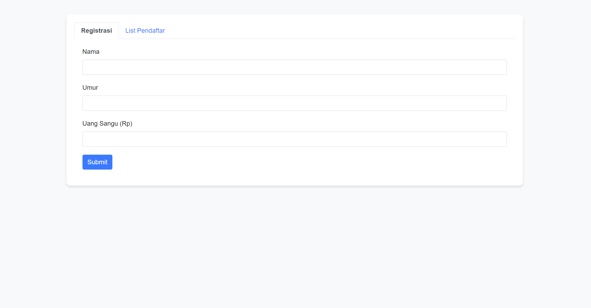
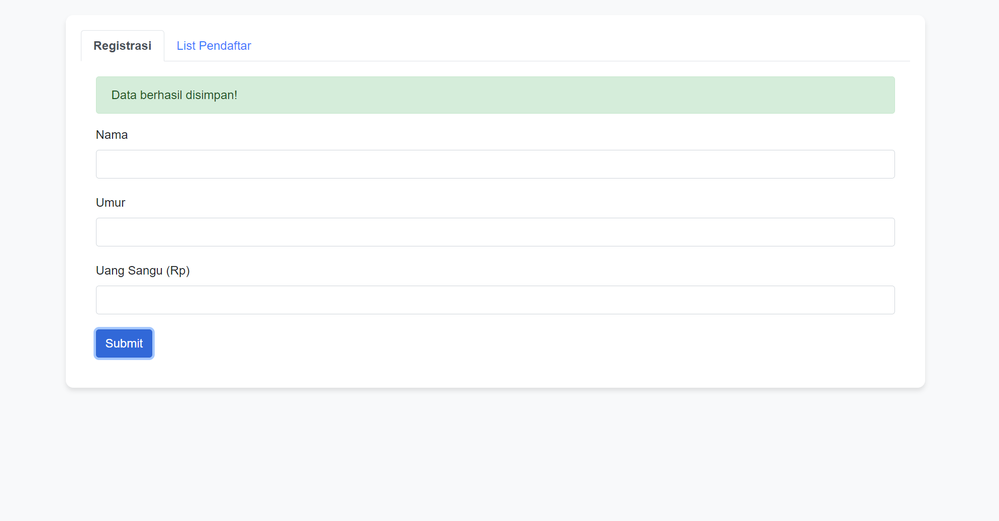
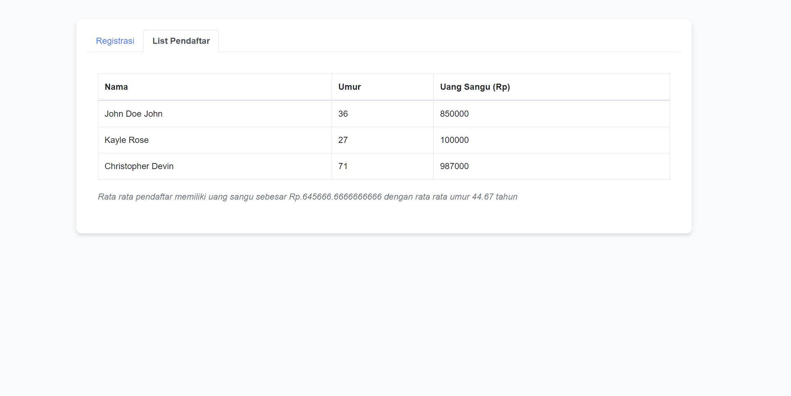

# Simple Registration Page

## Kontributor
Husnia Munzayana

## Penjelasan Ringkas Program
Repositori ini berisi implementasi program untuk halaman registrasi. Halaman terdiri dari 2 tab: FOrmulir Registrasi dan daftar seluruh pendaftar beserta insight/ringkasannya. Implementasi registration page ini dilakukan dengan menggunakan HTML dan CSS. 

## Cara Menjalankan Program
1. Clone repository ini :
   ``` https://github.com/munzayanahusn/hw05_simple_form.git ```
2. Buka `index.html` pada folder `src` pada browser Anda

## Tampilan Halaman

### Registration Page


### Notifikasi Sukses Menyimpan Data Pendaftar


### List Pendaftar


## Struktur Folder
```
.
├── src                   # Folder kode implementasi page
    ├── index.html
    └── style.css
├── img                   # Folder gambar dokumentasi/screenshot tampilan halaman
    ├── registrants.png
    ├── registration.png
    └── success.png
├── case_desc.txt         # Desripsi kasus permasalahan
└── README.md
```
